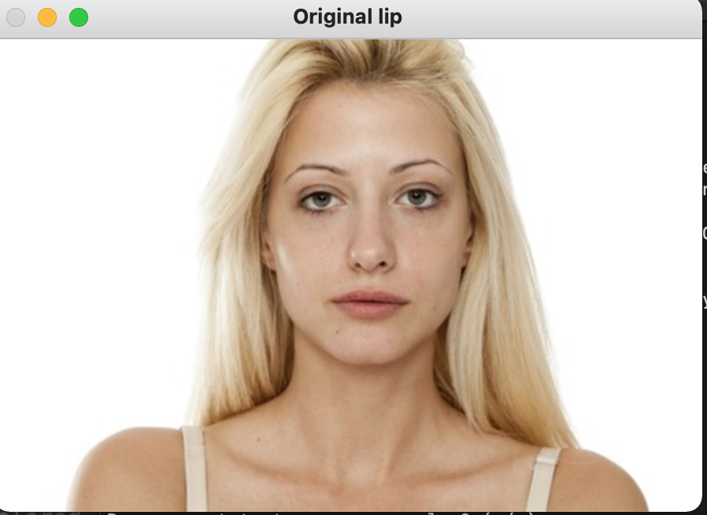
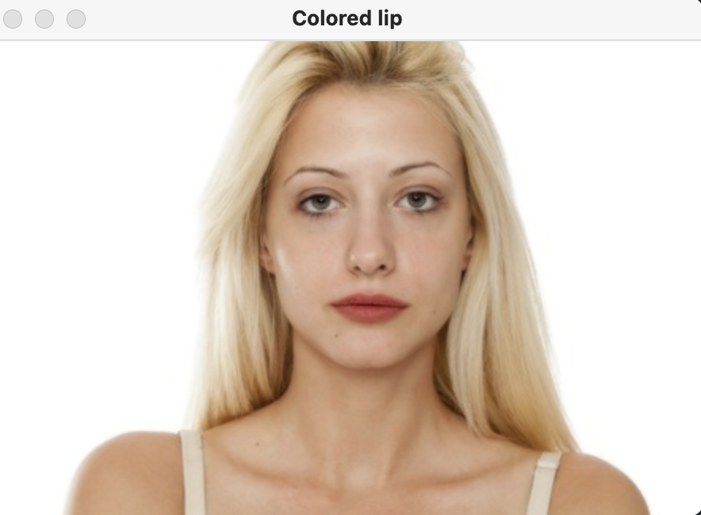
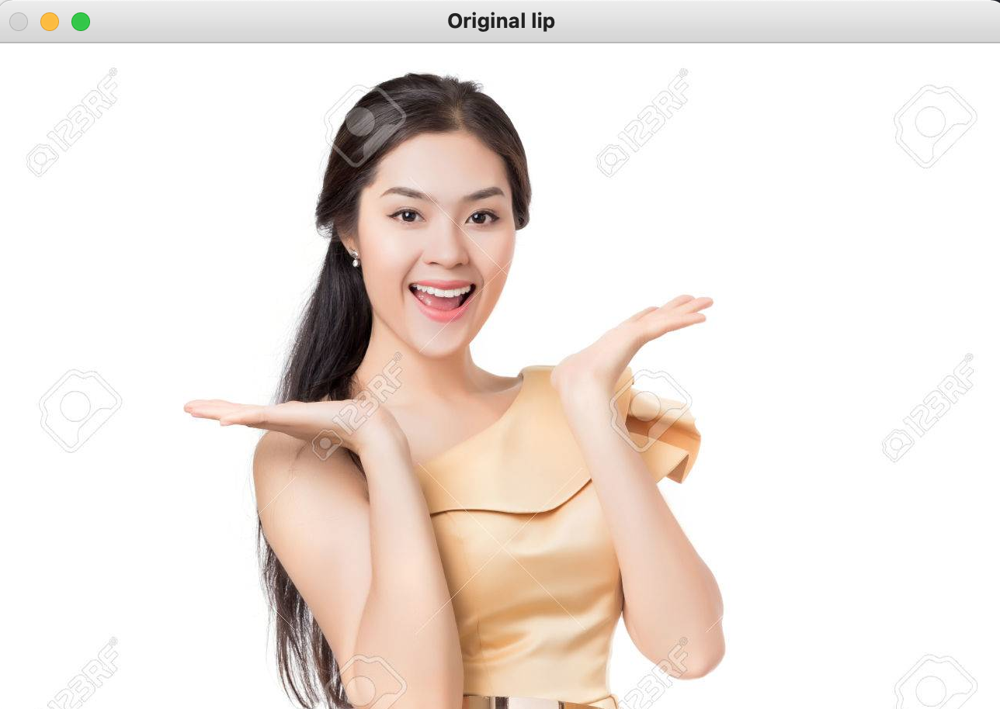
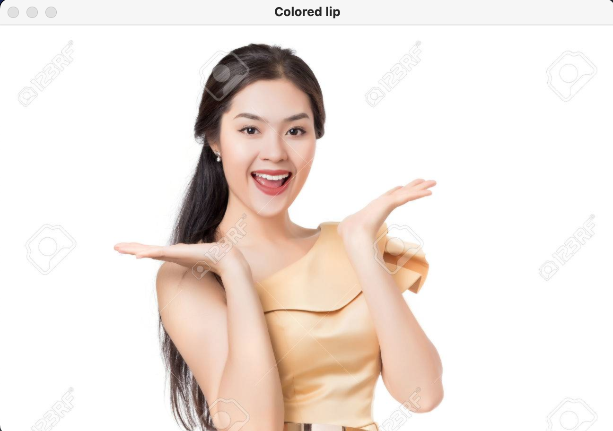
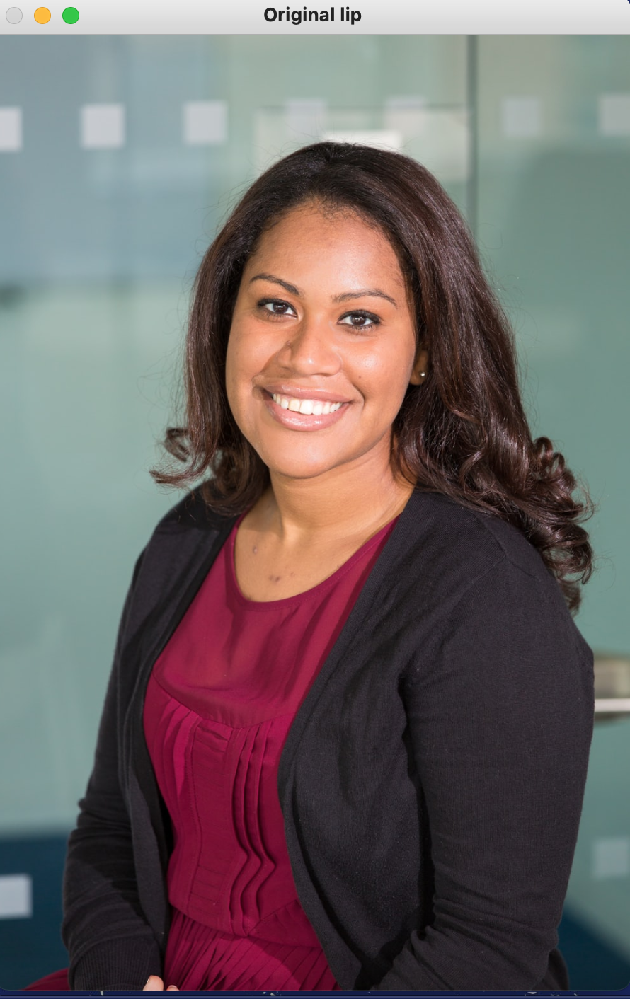
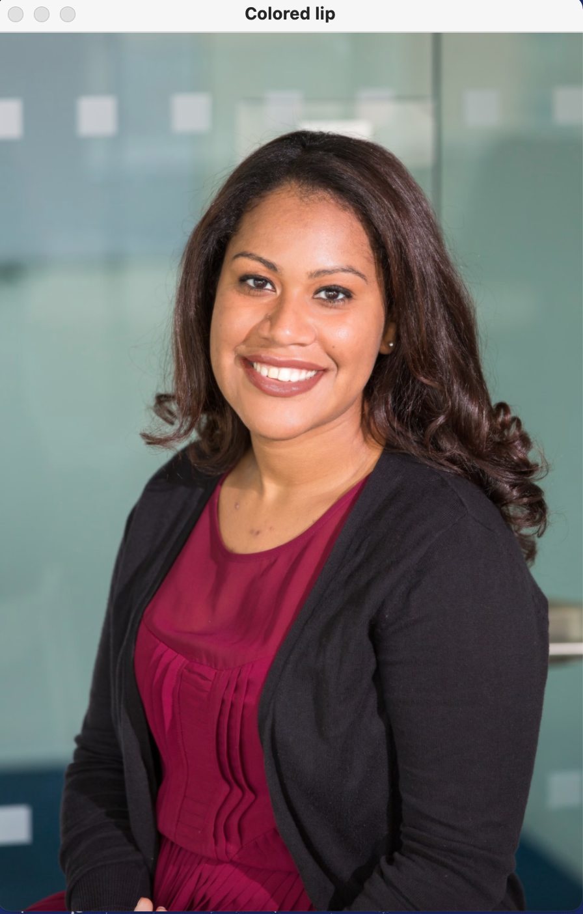

# Project Report

## Mai Nguyen Dac & Adam Shinomiya


In the past two years, online shopping has become an essential part of daily life, as in-person shopping posed health risks during the pandemic. However, the rapid rise of e-commerce brought new challenges—previous studies (Schröder & Zaharia, 2008) have shown that customers often perceive greater risks with online or mobile shopping compared to traditional retail, especially in product categories requiring personalization.

Makeup and personal care products, which became the top-selling category online during the pandemic, are particularly difficult to purchase virtually due to the wide variation in skin tones, undertones, hair types, and hormonal differences. As a response to this challenge, our team proposed a Virtual Product Try-On solution to help consumers confidently choose the right products, while also boosting sales for retailers.

After conducting thorough research and reviewing relevant course materials, we developed a Virtual Lipstick Try-On Application using OpenCV, NumPy, and dlib. The application offers six lipstick shades—Punch, Rose, Brick Red, Dusty Rose, Nude, and Royal Blue—which users can try on virtually in real time to find the most flattering color. Once a color is selected, the system recommends a set of commercially available lipsticks that closely match the selected shade.

This application not only saves time and reduces uncertainty for customers but also improves the gifting experience, allowing users to confidently choose lipstick shades for others. By combining computer vision with personalized beauty recommendations, our tool offers a seamless and efficient shopping experience for the modern consumer.

## Usage guidelines

1. Downloading dependencies

- Install Homebrew: `/bin/bash -c "$(curl -fsSL https://raw.githubusercontent.com/Homebrew/install/HEAD/install.sh)"`

- Upgrade pip if needed: `pip3 install --upgrade pip`

- Install dlib's dependencies with a list of command:
```
brew install cmake
brew install boost
brew install boost-python
brew install dlib
pip3 install numpy
pip3 install scipy
pip3 install scikit-image
```
- Install dlib: `pip3 install dlib` or `python3 -m pip install dlib`

- Install opencv: `pip3 install opencv-python`

2. Run command

The whole virtual try-on application run with command: `python3 lipstick_apply.py`

3. Try-on Image path guideline

- The command prompt will ask user for the file path that contain the image they want to try lipstick color on. User has to make sure that the file path is valid and thorough enough, for example: `/Users/Desktop/test_image_2.jpg`.

## Resources and references

[1] [Virtual Makeup using OpenCV source code](https://github.com/srivatsan-ramesh/Virtual-Makeup)

[2] [Lipstick Simulation Technique](https://static1.squarespace.com/static/5c3f69e1cc8fedbc039ea739/t/5d01686862182d0001b776a2/1560373362585/12_Lipstick_Simulation_Paper_For_Submission.pdf)

[3] [Another Virtual Make up source code](https://github.com/hriddhidey/visage)

[4] [The impact of AR on makeup firms](https://www.sciencedirect.com/science/article/pii/S0148296321002939)

## Experimental Results

1. Experiment with open/close mouth

This experiment is to test if the landmark coordinate can capture the entire lip when the mouth state is close and when the mouth state is open or showing a big smile.


| Mouth state      |   Original image   | Image after lipstick try on|
| ---------------- | ------------------- |---------------------------|
| Close mouth| | |
| Open mouth/big smile| |  |

From the output, we can say that the landmark coordinate can successfully capture the whole lip even when the picture showing a big smile.

2. Experiment with different skin tones

This experiment is to test if the coloring method and parameters in color blending method still return a natural colored blended image with different skin tone.

| Skin tone      |   Original image   | Image after lipstick try on|
| ---------------- | ------------------- |---------------------------|
| Pale| ||
| Fair|| |
| Dark|| |

From the experiment output, we see that the coloring method and parameters in color blending method always return a smoothed, well blended lip color with any user's skin tone.
